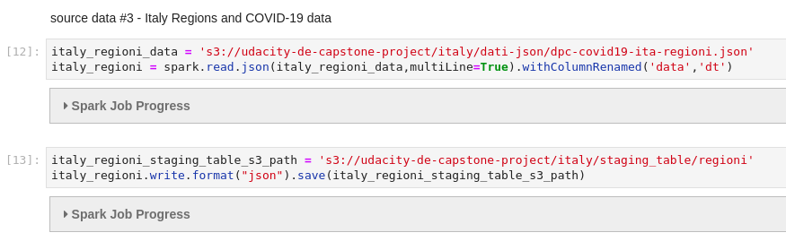
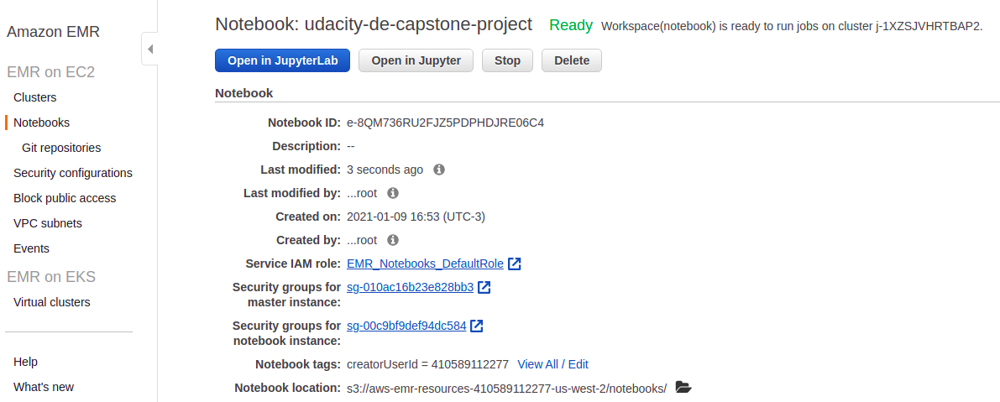
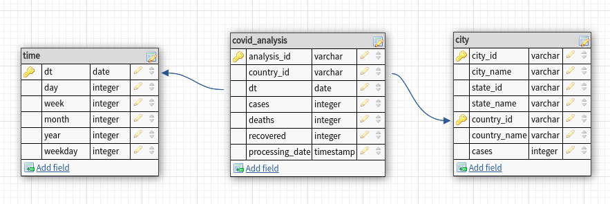
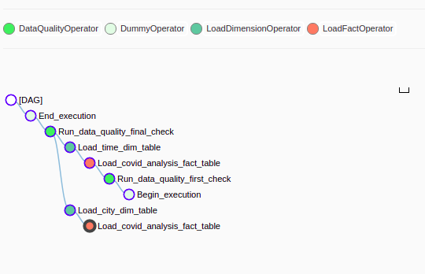

# Behavioral analysis of governments during the pandemic
## Udacity - Data Engineering Capstone Project

### Project Summary

This project aims to demonstrate how governments and authorities can induce the population to follow (right or wrong) ideas, specifically with regard to Coronavirus disease (COVID-19). The main reason to idealize this analysis is show how a lot of deaths could be avoid when the right (or better) person is in the right place. Analyzing results in these datasets in Spark or tables in Redshift, we can be sure that public politics applied the right way, it could save lives.

These two videos can explain how different was the treatment in the beginning of this crisis:

* "Italy doesn't stop, Milan doesn't stop" - https://www.youtube.com/watch?v=kqQ0M42I_A0

* "Angela Merkel uses science background in coronavirus explainer" - https://www.youtube.com/watch?v=22SQVZ4CeXA

### Gathering Data
-- To perform this analysis, it was used the following datasets available in Kaggle:
* https://www.kaggle.com/headsortails/covid19-tracking-germany - Germany Daily Updated Cases & Deaths - Augmented with geospatial & demographics info
* https://www.kaggle.com/lorenzopagliaro01/coronavirus-italian-data - Evolution of Coronavirus in Italy with daily data from the italian government

-- Format Types:
* Germany file is available in CSV format with header
* Italy files are available in both CSV and JSON format

-- Italy CSV file is corrupted since there are some records without comma and quotes, to be sure about integrity of files it were used to process just Italy JSON files and Germany files in CSV format, then, trying to use Italy JSON files with COPY in AWS Redshift, an error occurred about file size, that AWS Redshift only work with JSON file size under 4MB, for that reason, all JSON files was read by Spark and then write to S3 Bucket as JSON in small files, to be able to work with AWS Redshift.



-- Technologies used to do this analysis:
* AWS S3
* AWS EMR (Apache Spark, Jupyter Notebook)
* AWS Redshift
* Apache Airflow
* Jupyter Notebook (to process JSON files in small parts, and to analyze data after data pipeline process)

### Data Model

--AWS EMR/Spark:

It was created a cluster with Spark, JupyterHub, and all steps of processing staging tables was configured in Jupyter Notebook, created in notebook menu under EMR cluster options



-- AWS Redshift:
It was used default configs to create this cluster, and all kind of interaction with Redshift was did using postgresql client (psycopg2) in EMR cluster

--Packages to run Jupyter Notebooks:
Next step was install and update the following packages in EMR cluster to get commands done without errors in Jupyter Notebook, it's possible to config a bootstrap file to do that every time a new cluster is starting:

```
yum install -y python36 python36-devel python36-setuptools gcc python-setuptools python-devel postgresql-devel
easy_install-3.6 pip
pip3 install boto3 psycopg2
pip install --upgrade pip
```

-- Relationship between tables:

Star Schema was used to give simplicity to this model, since there are two different sources of data, and columns and files (tables) are different, this model extract what exists in both data sources, and give opportunity to analyze both countries "in one query" using fact table, and then, if needed, a time table is available to find a point in time of what is needed. Also, cities table give opportunity to separate cases in Italy by region, because since it happened differente kind of public politics, it's possible to check how north and south of Italy is differente in cases of COVID-19



### Data Pipeline

After start Airflow service, Redshift connection need to be configured before turn on DAG:


Airflow DAG first step is run data quality task in staging tables that was populate by EMR/Spark, after that, time, city and covid_analysis tables are created and data is inserted, and finally, data quality task runs before end execution to guarantee data integrity to be used by analysts.



--Data Quality:

Data Quality tasks check if column contains null, count total of rows and according to a number (called magic number) that you set in a parameter in DAG file, validator check if total number of rows is more or less this "magic number", if so, task would fail and log an alert to check what happened.

--Data Dictionary:

```
covid_analysis
|   analysis_id   | table id in md5 type              |
|:---------------:|-----------------------------------|
| country_name    | 'Germany' or 'Italy'              |
| dt              | date YYYY-MM-DD                   |
| cases           | number of cases in dt             |
| deaths          | number of deaths in dt            |
| recovered       | number of recovered people        |
| processing_date | processing date using getdate()   |
```
```
city
| city_id      | table id in md5 format        |
|--------------|-------------------------------|
| city_name    | city of country_name          |
| state_id     | state id in md5 format        |
| state_name   | name of state in country_name |
| country_id   | country                       |
| country_name | 'Italy' or 'Germany' country  |
```
```
time
| dt      | table id in table using YYYY-MM-DD |
|---------|------------------------------------|
| day     | day extracted from dt              |
| week    | week extracted from dt             |
| month   | month (numeric) extracted from dt  |
| year    | year extracted from dt             |
| weekday | weekeday (1-7) extracted from dt   |
```

Also, there are staging tables (staging_germany, staging_italy_province and staging_italy_regioni) contain all data declared in original projects in Kaggle.

### Addressing Other Scenarios (What if?)

#### The data was increased by 100x.
 - AWS EMR is easy to increase number of nodes in EMR if processing time it's a needed;
 - AWS Redshift is algo simple to increase or decrease the number of nodes;
 - Schedule time can be changed to execute earlier if tasks is taking longer than usual, another solution could be processing data during the day and not just once a day.
 
#### The data populates a dashboard that must be updated on a daily basis by 7am every day.
 - Upsert strategy already exist in DAG plugins
 
#### The database needed to be accessed by 100+ people.
 - There is a possibility to think about using EMR Spark for processing high volume of data, and another strategy is increase capacity of AWS Redshift.
